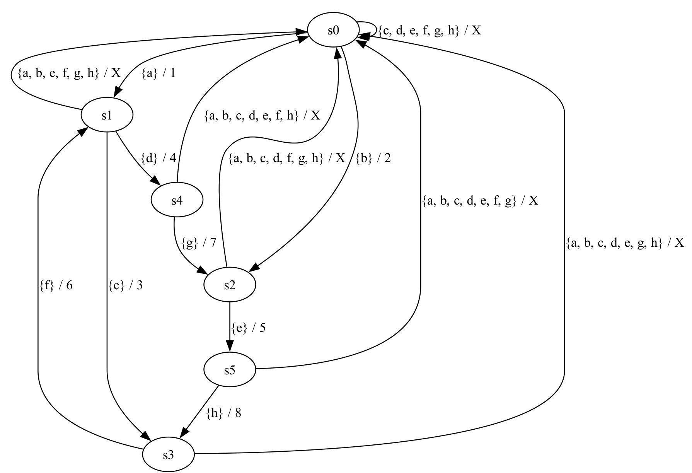
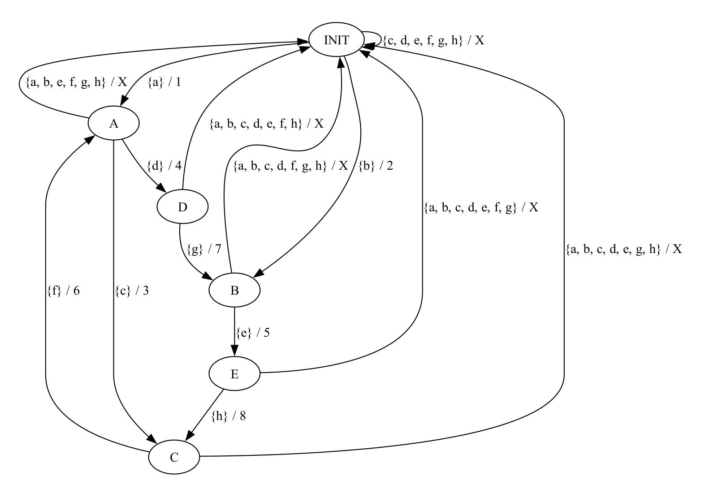

# Mealy-Machine

This repository provides a simple implementation of a Mealy Machine in C++.
The working principle of a Mealy Machine resembles a protocol, where the output is determined by the current state and the input.

The machine is defined by a set of states, an input alphabet $\Sigma$, an output alphabet $\Lambda$, a transition function $\delta: Q \times \Sigma \rightarrow Q$ and an output function $\lambda: Q \times \Sigma \rightarrow \Lambda$.
A word $w = w_1w_2...w_n$ is accepted by the machine if there exists a sequence of states $q_0, q_1, ..., q_n$ such that $q_{i+1} = \delta(q_i, w_{i+1})$ and the output of the machine on input $w$ is $\lambda(q_n, w_n)$.

## Implementation

The implementation is very simple and looks like this:



The input alphabet consists of letters `{a, b, c, d, e, f, g, h}`, and the output alphabet consists of `{1, 2, 3, 4, 5, 6, 7, 8, X}`.

"Fun Fact": This representation has been extracted via automata learning (L* / TTT), without any prior knowledge of the machine's structure and implementation. 
In-fact, the machine was implemented to apply automata learning on it.
An adapted version of the graph is provided below, where the states are labeled accordingly.



## Usage

Dependencies:
- LLVM (clang)
- [LLVMGlobalInstrumentation](https://github.com/Jojeker/LLVMGlobalInstrumentation)

To build the project, run the following commands:

```bash
# The implementation requires the LLVMGlobalInstrumentation (and the path `PASS_PATH` to it)
make -DPASS_PATH=/path/to/LLVMGlobalInstrumentation

# Run
./mealy_machine
# Input a-h to see the output
# To stop Ctrl+C
```

The output is not only the result of the machine, but also memory state changes, that occur during the computation. 
This way the implementation can be tracked more easily.

> Note: The implementation requires 